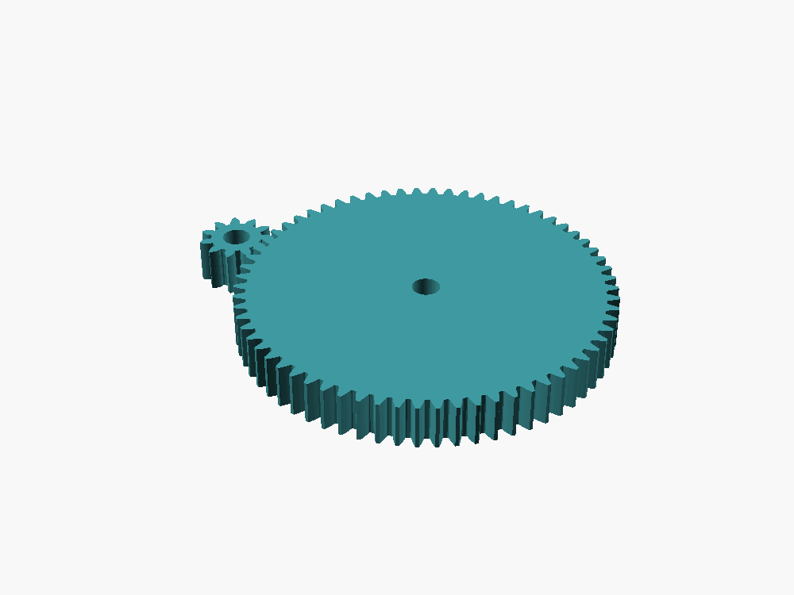

# Example: single-stage spur gear reduction



An 11-tooth pinion driving a 66-tooth spur gear (6:1 reduction, module 1.0),
built with `scad-modeler` end to end: calculation table → centralized
params → per-part local coordinates → assembly layout → full validation
chain, including the part this skill is actually for — **verifying the
gears mesh correctly through a full rotation, not just in one static
pose**.

## Run it yourself

```bash
cd scad-modeler/examples/gear_reduction
bash ../../scripts/validate_scad.sh --all
```

Expected: every part renders as one connected body, both declared 5mm bores
measure correctly, the declared gear-mesh contact is checked against a real
measured penetration depth (not a guess — see the comment in `joints.json`),
and `motion_sweep.py` sweeps the full 360° rotation and confirms no
unexpected interference anywhere in the cycle. Exit code 0, ending in
`All validations passed.`

Then, before treating it as done:

```bash
python3 ../../scripts/check_rules.py --project-dir .
```

## What this demonstrates

- **`params.scad`** — every dimension in one place, with `assert()`
  invariants (the reduction ratio, the shaft bore vs. the pinion's own
  pitch diameter).
- **Real gear teeth, not placeholder cylinders** — `parts/pinion.scad` and
  `parts/spur.scad` use BOSL2's `spur_gear()`, not hand-rolled involute
  math (SKILL.md §5 explains why: a from-scratch implementation failed
  silently on a degrees/radians unit bug that looked plausible in a
  render but was wrong by ~60x).
- **`layout.scad`** — positions both parts in one shared assembly
  coordinate system via `at()`. Also documents a real, non-obvious BOSL2
  gotcha found while building this example: `layout.scad` must itself
  `include <BOSL2/std.scad>` and `include <BOSL2/gears.scad>` even though
  it never calls a gear function directly, because BOSL2 redefines
  `translate()`/`rotate()` to track internal special variables that a
  gear module positioned through a plain (non-BOSL2-aware) `at()` can't
  otherwise see — read the comment at the top of the file for the full
  explanation.
- **`joints.json`** — a declared `gear_mesh` contact whose
  `expected_interference_mm` range and `multi_region_ok: true` flag were
  both set from an *actual measurement* of this exact gear pair (see the
  comment in the file), not guessed: real involute teeth interpenetrate
  more deeply than a simple press-fit backlash range, and a standard
  involute pair's contact ratio means more than one tooth pair is
  legitimately in contact at once.
- **The full validation chain** — connectivity, bore measurement,
  declared-contact penetration depth, multi-region contact detection, and
  a full motion sweep, all wired into one `validate_scad.sh --all` call.

## What this deliberately skips

This is a 2-part, single-purpose gear pair with an obviously simple
architecture — exactly the case SKILL.md names as safe to skip §0.5
Planning and §0.6 Physical assembly narrative for. It also doesn't model
any purchased hardware (bearings, a real motor shaft) as NopSCADlib
vitamins — see `scad-modeler/references/hardware.md` for that, on a real
assembly where it matters.
