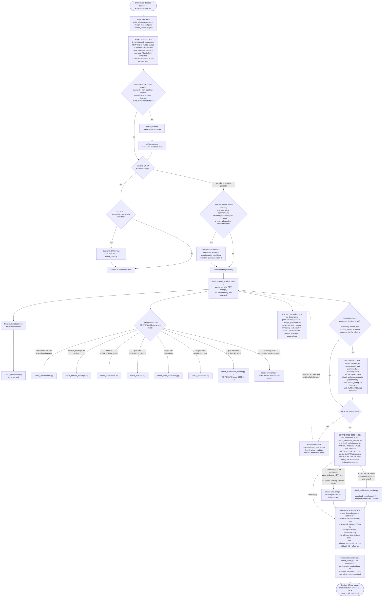

<!-- RAG-passport: file=references/validation_decision_tree.md | skill=scad-modeler | applies_to=[which-check, validation, navigation] | version=2026-09-12 | source=06_RAG_taisykles (T2) + AB_IRANKIAI -->
# Validation decision tree — v3 (2026-09-12)

Quick-reference for "which check applies to my situation right now" — the
skill has **17 scripts** emitting **18 declared checks**, with different triggers
(mandatory, opt-in by file/comment, advisory), plus two process stages
(intake/analysis and rules-enforcement). This diagram is a **navigation aid, not
the authoritative source**: the prose in SKILL.md (with its incident citations)
and the referenced documents below are what to trust if this ever drifts out of
sync — check this file's date against the section headers it maps if in doubt,
since nothing regenerates it automatically.

**v3 was corrected against the running code, not against the v2 prose.** Diffing
this file against what `validate_scad.sh --all` actually emits found four
errors, all fixed here:

| Error | Was | Is |
|---|---|---|
| `collisions` and `subfeature_overlap` | MANUAL, "validate_scad.sh does NOT run these" | **both run automatically** in the bundle |
| `analytic_bounds`, `margin_provenance`, `param_context`, `printability`, `render`, `mechanics` | not mentioned at all | present, all emitting `CHECK_RESULT` |
| Verdict model | absent | **five outcomes** |
| Script count | ~12 | **17** |

**How to re-verify (do it after any checker change):**

```bash
cd <project> && bash <skill>/scripts/validate_scad.sh --all \
  | grep -oE '^CHECK_RESULT [a-z_]+=' | sed 's/CHECK_RESULT //; s/=//' | sort -u
```

Compare that list against the diagram. If they differ, the diagram is wrong.

v2 changes (this revision): added **Stage 0 intake** (brief → requirements
spec, `check_intake.py` gate, built+tested 2026-08-19) and **Stage 0.5
analysis** (printed-vs-purchased classification + similar-variant retrieval
via direct README read-through, not an embedding index — the archive is too
small to need one), added the **change-propagation step** (dependency DAG —
`check_dependencies.py`, built+tested, see `change_propagation.md`), added
the **rules-enforcement gate** (`rules_manifest.yaml` + `check_rules.py`,
built+tested, mandatory before the final report, see `rules_enforcement.md`),
and wired the **mechanics stage** to trigger automatically from a non-empty
`joints.json#motion` array — NOT `design_manifest.json.motion`, which two
earlier drafts of this reference set proposed independently and
inconsistently with each other and with `motion_sweep.py`'s own real
interface (see `mechanics_and_motion_planning.md` §3, corrected 2026-08-19).
The validated v1 core (env check, planning, narrative, `validate_scad.sh
--all`, check ordering) is unchanged.



**Why there's a loop in this diagram, not one straight line**: `AllPass -- no --> FixSource --> Validate` is a real cycle,
not a mistake — it's the "fix at the source, re-run the whole thing from the top" policy this skill enforces
everywhere (SKILL.md §7, `INCIDENTS.md`), not a one-shot linear pipeline. A design can fail validation, get
fixed, and needs the *entire* chain re-run, not just the one check that failed — so the diagram loops back on
purpose. Everything else in the graph is a DAG (no other cycles).

## The verdict model (added 2026-09-12)

Every check in the diagram reports one of **five** outcomes, not a boolean. Each has
a different next action, which is why the distinction is load-bearing:

| Outcome | Means | Next action |
|---|---|---|
| `PASS` / `FAIL` | ran; the answer is known | FAIL: fix the model |
| `not-applicable` | does not apply here | add the declaration if it should apply |
| `inconclusive` | **ran and could not determine an answer** | fix the checker or its inputs |
| `advisory` | ran, reports, does not gate | read it and judge |

Each run ends with `COVERAGE: N passed, N failed, N not-applicable, N inconclusive, N advisory`.
`check_rules.py` adds a **COVER** report naming rules whose antecedent never fired
(and **PERVASIVE** when those are the majority). Before 2026-09-12, ten of the eighteen
checks emitted nothing at all on a real project, so a reader could not tell „did not run“
from „passed“ from „does not exist“. Measured on 11 projects: 89 `CHECK_RESULT`
lines became 198, and 0 of 11 runs carried a coverage count versus 11 of 11.

## Notes on the new stages

- **Stage 0 / 0.5 are model work, not script work**: the requirement spec and
  the printed-vs-purchased classification are produced by the model, but they
  are *gated* — `check_intake.py` verifies the spec file exists and matches the
  JSON schema before modeling may start. Detail:
  `scad-modeler/references/intake_and_analysis.md`.
- **Mechanics triggers automatically** from a non-empty `joints.json#motion`
  array (built and tested 2026-08-19, wired directly into
  `validate_scad.sh`) — not `design_manifest.json.motion`; static collision
  check is always a precondition of the motion sweep (sweep over
  already-colliding static geometry is meaningless).
- **Change-propagation does not replace the blanket re-run**: it makes the
  usual case (one parameter edited) cheap and targeted, and escalates to the
  full `validate_scad.sh --all` on any parse uncertainty or when a file `mtime`
  changed. Param-only edits skip rendering entirely.
- **The rules gate is the last thing before the report**: no report without a
  `check_rules.py` run cited in it. This is the enforcement loop that makes
  rule-following independent of model memory.

## Reference files

- `validation.md` — the gate-by-gate reference behind SKILL.md §7: what each check catches, declaration semantics, tolerances, exit codes, edge cases.
- `intake_and_analysis.md` — Stage 0/0.5: requirements schema, printed-vs-purchased criteria, variant retrieval.
- `mechanics_and_motion_planning.md` — motion taxonomy, fit tables, design manifest schema.
- `change_propagation.md` — dependency DAG, dirty-root algorithm, user-facing choice-tree output.
- `rules_enforcement.md` — why agents drift, layered enforcement (prompt/gates/self-check/manifest), failure handling.
- `../INCIDENTS.md` — append-only log of real bugs found and fixed.
